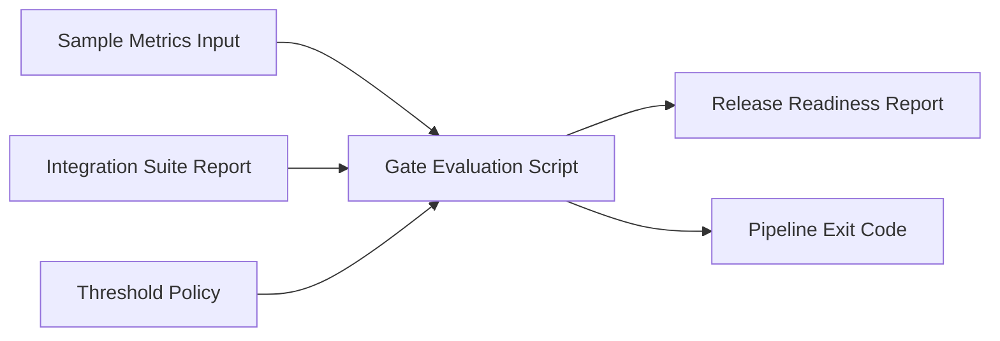

# CI/CD Quality Gates Reference Implementation

## Portfolio Role
This repository is the governance decisioning part of the portfolio story.
It shows how metrics, integration evidence, and policy combine into explicit PASS, WARN, or BLOCK release outcomes.

## Profile Map
- Portfolio narrative: governance decisioning
- Skill signal: release governance and CI/CD quality gates
- Review focus: threshold policy, combined report input, and auditable readiness decisions
- Evidence anchor: `docs/evidence-integration.md`

## Business Value
- Converts abstract quality discussions into explicit pass or fail policy.
- Produces an auditable readiness report that can be attached to release approvals.
- Makes threshold governance reproducible in local and CI execution.
- Consumes upstream integration-suite decisions to produce cross-repo release governance.

## Architecture


## What This Proves
- You can embed quality checks directly into delivery pipelines.
- You understand release governance, thresholds, and actionable failure signals.
- You can design quality gates that teams can actually operate.

## Included in Day 1
- Pipeline templates for GitLab and Jenkins
- Smoke test and gate scaffolding
- Threshold configuration files
- Documentation for quality policy and release criteria

## Quick Start
```bash
./run-tests.sh
```

Windows alternative:
```powershell
python scripts\evaluate_gates.py sample-data\metrics.json
```

With integration suite input:
```powershell
python scripts\evaluate_gates.py sample-data\metrics.json sample-data\integration-suite-report-pass.json
```

## Demonstrable Behavior
1. Evaluates real sample metrics.
2. Optionally evaluates integration-suite report outcomes from another repository.
3. Writes a release-readiness report to the reports folder.
4. Returns PASS, WARN, or BLOCK based on combined governance rules.

## Core Files
- scripts/evaluate_gates.py
- sample-data/metrics.json
- sample-data/integration-suite-report-pass.json
- sample-data/integration-suite-report-warn.json
- gates/thresholds/performance-thresholds.json
- gates/thresholds/quality-policy.yaml

## Evidence
1. Base metrics evaluation: docs/evidence.md
2. Cross-repo integration governance: docs/evidence-integration.md

## Roadmap
1. Add pipeline stages for build, smoke, performance, and accessibility
2. Add threshold policy evaluation
3. Publish reports and release readiness summary
