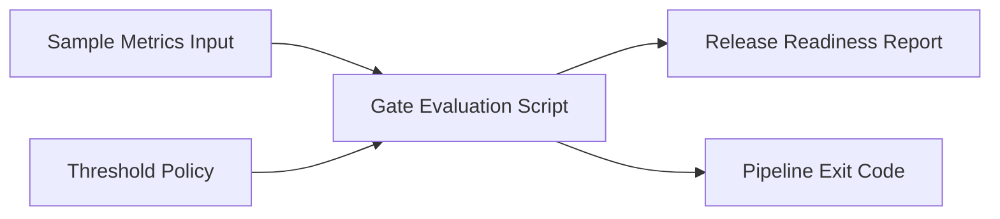

# CI/CD Quality Gates Reference Implementation

Reference repo showing how automation, performance, accessibility, and static analysis can be enforced as release gates.

## Business Value
- Converts abstract quality discussions into explicit pass or fail policy.
- Produces an auditable readiness report that can be attached to release approvals.
- Makes threshold governance reproducible in local and CI execution.

## Architecture


## What This Proves
- You can embed quality checks directly into delivery pipelines.
- You understand release governance, thresholds, and actionable failure signals.
- You can design quality gates that teams can actually operate.

## Included in Day 1
- Pipeline templates for GitLab and Jenkins
- Smoke test and gate scaffolding
- Threshold configuration files
- Documentation for quality policy and release criteria

## Quick Start
```bash
./run-tests.sh
```

Windows alternative:
```powershell
python scripts\evaluate_gates.py sample-data\metrics.json
```

## Demonstrable Behavior
1. Evaluates real sample metrics.
2. Writes a release-readiness report to the reports folder.
3. Fails when any gate crosses a threshold.

## Core Files
- scripts/evaluate_gates.py
- sample-data/metrics.json
- gates/thresholds/performance-thresholds.json
- gates/thresholds/quality-policy.yaml

## Evidence
See: docs/evidence.md

## Roadmap
1. Add pipeline stages for build, smoke, performance, and accessibility
2. Add threshold policy evaluation
3. Publish reports and release readiness summary
