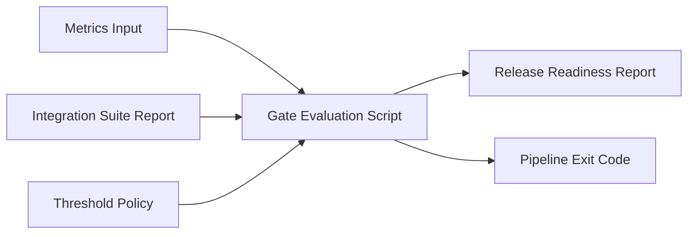

# CI/CD Quality Gates

A runnable reference implementation of release quality gates: feed it metrics (smoke results, performance numbers, accessibility violations, static analysis) plus an optional integration-suite report, and it produces an explicit **PASS**, **WARN**, or **BLOCK** decision with an auditable readiness report.

The point is to turn "are we ready to release?" from a meeting into a script.

## Architecture


```mermaid
flowchart LR
	Metrics[Metrics Input] --> Evaluator[Gate Evaluation Script]
	Integration[Integration Suite Report] --> Evaluator
	Policy[Threshold Policy] --> Evaluator
	Evaluator --> Report[Release Readiness Report]
	Evaluator --> Exit[Pipeline Exit Code]
```

## Quick Start

```bash
./run-tests.sh
```

Windows:

```powershell
python scripts\evaluate_gates.py sample-data\metrics.json
```

With an integration-suite report as second input (try the `-warn` and `-block` variants in `sample-data/` to see all three decisions):

```powershell
python scripts\evaluate_gates.py sample-data\metrics.json sample-data\integration-suite-report-pass.json
```

## How It Decides

Thresholds live in `gates/thresholds/` (JSON + YAML) and are evaluated in `scripts/evaluate_gates.py`:

- Any hard failure (smoke, latency/error-rate/throughput breach, accessibility criticals, analysis blockers) → **BLOCK**
- Integration suite warnings with no hard failures → **WARN**
- Clean across the board → **PASS**

The exit code mirrors the decision, so it drops straight into any pipeline.

## What's Inside

- `scripts/evaluate_gates.py` — the evaluator
- `gates/thresholds/` — performance thresholds and quality policy
- `sample-data/` — pass, warn, and block scenarios you can run as-is
- `ci/` — GitLab CI and Jenkins pipeline templates
- `docs/` — policy notes and evidence

## Roadmap

- Unit tests for the evaluator itself (threshold boundaries, escalation rules)
- JUnit/JSON/Markdown report formats for pipeline integration
- GitHub Actions workflow with the readiness report as a build artifact

## License

MIT — see [LICENSE](LICENSE).
